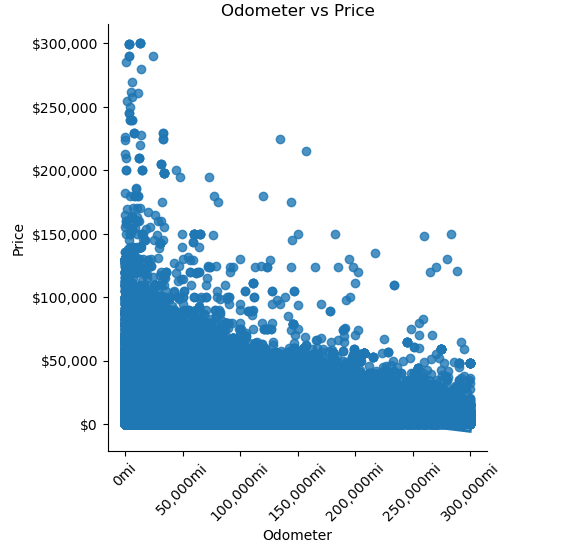

# What are the key drivers for sell price on used cars?

In aim to best support our clientele, owners of used car lots across the marketplace, we are putting an data-set under the proverbrial microscope from trusted source kaggle.com to help improve client decision-making when the time comes to procure used car units for their 
lot.  What, historically, have been the key elements of a used vehicle that interested parties look for in when going to make a purchase?  To, even at the point of sale, what drives the price point upward to achieve optimal margins for our clients.  

The above bar graph reveals from our kaggle.com data, the primary drivers sought out by interested parties historically have been odometer readings & year of the car's origin.  

When plotted, we can see that historic sell prices of used car units show a negative correlation that reveals as odometer readings go up, the anticipated sell price goes down significantly.  For these reasons, we as business anlaysts recommend our clients to first qualify an odometer reading value before agreeing to add any new used car units to their lot(s).
